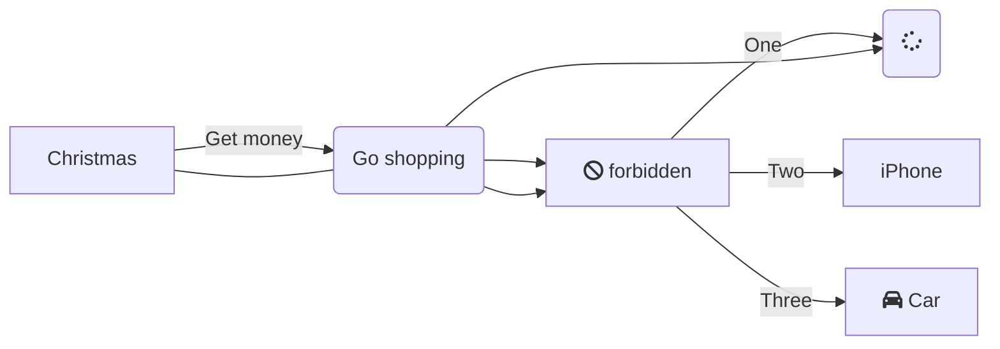

## Описание репозитария
В репозитарии находятся две шпаргалки из миллиона)).
### Инструкции по инициализации локального репозитория.
1. Запускаем **Git Bash**
2. Создаем папку для локального репозитория и переходим в созданную директорию.  
**$mkdir gitInstructions && cd gitInstructions[Enter]**
3. Создаем локальный репозиторий  
**$git init**
### Связываем пустой удаленный репозиторий и локальный репозиторий
1. На сайте **GitHub.com** заходим в пустой удаленный репозиторий и копируем URL ссылку типа SSH
2. **$git remote add origin git@github.com:%ИМЯ_АККАУНТА%/first-project.git (пример из Яндекс практикума)**  
Команде необходимо передать два параметра: имя удалённого репозитория и его URL. В качестве имени используйте слово origin. А URL вы скопировали со страницы удалённого репозитория.
3. Убедиться, что репозитории связаны  
**$git remote -v**
```
$ git remote -v
origin    git@github.com:%ИМЯ_АККАУНТА%/%ИМЯ-ПРОЕКТА%.git (fetch)
origin    git@github.com:%ИМЯ_АККАУНТА%/%ИМЯ-ПРОЕКТА%.git (push) 
```
----
### Команды Git
#### log
1. Полный лог репозитария **git log**
2. Сокращенный лог **git log --oneline**

HEAD -- это голова.
Коммит -- это всему голова.
Статусы файлов:
<тут пустая строка!>


<и тут пустая строка!>  
When $a \ne 0$, there are two solutions to $(ax^2 + bx + c = 0)$ and they are 
$$ x = {-b \pm \sqrt{b^2-4ac} \over 2a} $$

----
[Яндекс Практикум](https://practicum.yandex.ru/)  
----