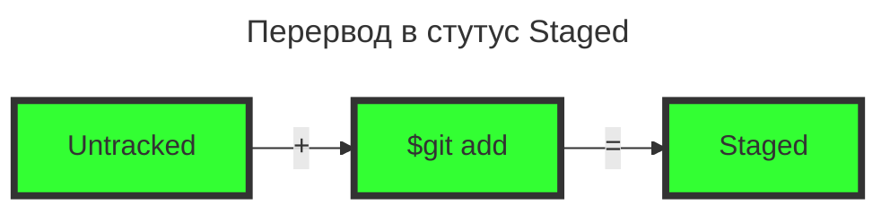
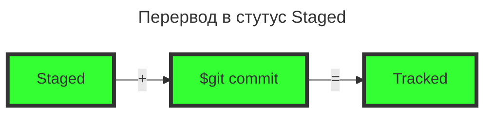

## Описание репозитария
В репозитарии находятся две шпаргалки из миллиона)).
### Инструкции по инициализации локального репозитория.
1. Запускаем **Git Bash**
2. Создаем папку для локального репозитория и переходим в созданную директорию.  
**$mkdir gitInstructions && cd gitInstructions[Enter]**
3. Создаем локальный репозиторий  
**$git init**
### Связываем пустой удаленный репозиторий и локальный репозиторий
1. На сайте **GitHub.com** заходим в пустой удаленный репозиторий и копируем URL ссылку типа SSH
2. **$git remote add origin git@github.com:%ИМЯ_АККАУНТА%/first-project.git (пример из Яндекс практикума)**  
Команде необходимо передать два параметра: имя удалённого репозитория и его URL. В качестве имени используйте слово origin. А URL вы скопировали со страницы удалённого репозитория.
3. Убедиться, что репозитории связаны  
**$git remote -v**
```
$ git remote -v
origin    git@github.com:%ИМЯ_АККАУНТА%/%ИМЯ-ПРОЕКТА%.git (fetch)
origin    git@github.com:%ИМЯ_АККАУНТА%/%ИМЯ-ПРОЕКТА%.git (push) 
```
----
### Хеш Git коммита
Хеш Git коммита - это когда был сделан коммит, содержимое файлов в репозитории на момент коммита и ссылка на предыдущий, или родительский (англ. parent), коммит.  

[Хеш — идентификатор коммита  Yandex Practicum](https://practicum.yandex.ru/trainer/git-basics/lesson/27b75a18-4c7c-4e4c-a216-39b30dc2fef6/)
### Команды Git

#### log
1. Полный лог репозитария **$git log**
2. Сокращенный лог **$git log --oneline**

### HEAD
Файл HEAD (англ. «голова», «головной») — один из служебных файлов папки .git. Он указывает на коммит, который сделан последним (то есть на самый новый). Хранит в себе хеш.  
[HEAD — всему голова Yandex Practicum](https://practicum.yandex.ru/trainer/git-basics/lesson/9d4c6ff5-4763-489e-a9d7-5aca58847fb9/)

### Статусы файлов
Существует 4 статуса:
1. Untracked  
Статус нового файла в папке локального коммита. Git не ведет и не знает историю изменений.  
Можно перевести:  
1.1 в статус Staged. Untracked + git add = Staged

2. Staged  
После выполнения команды git add, файл получает статус Staged.  
Выводится в списке **Changes to be committed**
Можно перевести:  
2.2 в статус Tracked  

2.3 в стутус Untracked  
git reset HEAD [filename]  
Changes to be committed: - обозначает статус Staged  
3. Tracked  
Статус файла - уже отслеживаются изменения. После выполнения команды **git commit**, файл получает статус Tracked.  
4. Modified  
При изменении отслеживаемого файла, git переводит статус файла в статус Modified.  
Выводится в списке **Changes not staged for commit**  

----
[Яндекс Практикум](https://practicum.yandex.ru/)  
----